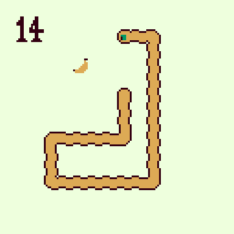

# uxn-worm



control using arrow keys. close the game with ctrl-q.

you need [Uxn](https://100r.co/site/uxn.html) to run this.
```bash
uxnemu worm.rom
```
---
you can assemble the game yourself with [drifblim](https://wiki.xxiivv.com/site/drifblim.html)
```bash
uxnemu drifblim.rom worm.tal worm.rom
```
